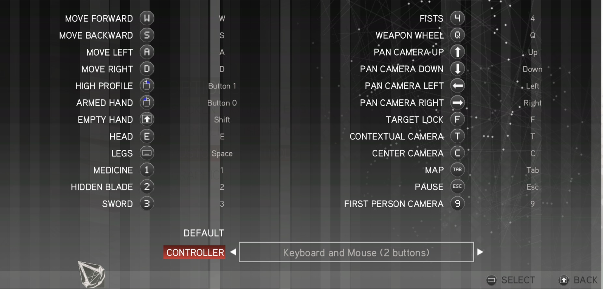

# AC2 Icon Patcher

Replaces the HUD and menu icons in **Assassin's Creed 2 (PC)** (Not tested on Ezio trilogy, only original) with the actual keyboard keys. Instead of a head, a hand and a pair of legs, you see `E`, `Shift`, `Space`, the mouse buttons and `WASD`.

## Why

AC2 on PC inherited its icon set from the console versions. The game tells you
to press "the head" and leaves you to work out that this means `E`. There is no
in-game option to change it.

## Install

1. Download `AC2IconPatcher.exe` from [Releases](https://github.com/Bat0oo/AC2IconPatcher/releases).
2. Close the game.
3. Run the exe and pick **3 - Install**.

It finds your install automatically, backs every file up as `.bak`, and takes a
few minutes. Option **4** puts everything back whenever you want.

No .NET installation needed - the exe is self-contained.

## Good to know

- Steam's **Verify integrity of game files** might undoe the mod.
- The icons show the **default** control scheme. If you rebound your keys, the
  icons will show the wrong ones; reading your own bindings isn't supported yet. (But probably will be in future)
- Original **Assassin's Creed 2** only, not the Ezio Collection remaster.
- Needs a few GB of free space for the backups.
- A few tutorial prompts show the wrong key. That's a bug in the game itself -
  it references the wrong icon there - and it existed before this mod; it just
  wasn't noticeable when every icon was an abstract symbol.

## How it works

The tool reads and writes Ubisoft's Anvil `.forge` archives directly. No
external tools, no third-party libraries, nothing bundled from the game.

The key icons are drawn in code at install time — there are no image assets in
this repo, which is also why nothing of Ubisoft's is redistributed here.

Along the way the archiveThe archive format had to be worked out from the files themselves: format had to be worked out from the files themselves.

- the `.forge` index layout, and the two traps in it (entries are not ordered by
  offset, and the name table is not at a fixed address)
- the `.data` container, which compresses its chunks with **LZO2A** - not LZO1X,
  which is what every managed LZO port implements, so none of them work here
- the checksum, which is Adler-32 with an initial value of 0 instead of 1
- the fact that raw chunks are supported, which is why no compressor is needed

If you're here for the format rather than the mod, that file is what you want.

## Building

dotnet build -c Release

Or run `build-exe.bat` for a self-contained single-file exe.

## Licence

GPL v2 or later - see [LICENSE](LICENSE). `src/Formats/Lzo2a.cs` is a port of
LZO2A decompression from Markus Oberhumer's LZO, which is GPL, so the project
inherits it.
